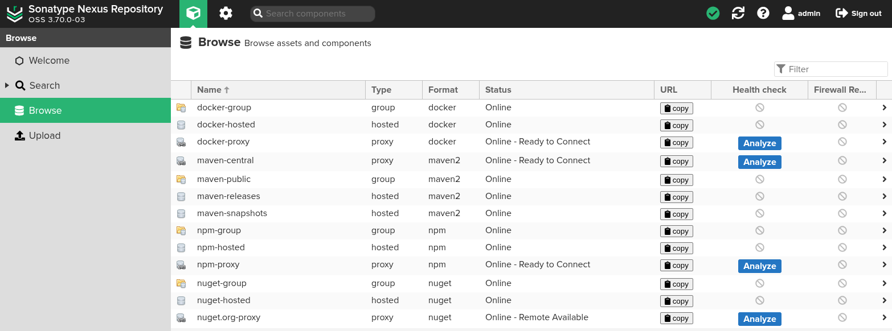

<h1 id="top" align="center">Nexus</h1>

<br>

<div align="center">
    
</div>

<br>

## 🔍 Table of Contents

- [About Project](#intro)
- [Dashboard](#dashboard)
- [Technologies](#technologies)
- [Features](#features)
- [Releases](#releases)
- [System Startup](#system-startup)
- [Access Management](#user-and-access-management)
- [NPM Management](#npm-management)
- [Contributors](#contributors)

<br/>

<h2 id="intro">📌 About Project</h2>

This project provides a Docker Compose setup to run **Sonatype Nexus Repository Manager 3 (OSS version)** in a containerized environment for managing software artifacts.

<br/>

<h2 id="dashboard">🐳 Dashboard</h2>

<div align="center">
    
</div>

<br/>

<h2 id="technologies">☄️ Technologies</h2>

&nbsp; [](https://www.docker.com/)

&nbsp; [](https://help.sonatype.com)

&nbsp; [](https://www.ibm.com/docs/bg/aix/7.2?topic=files-env-file)

<br/>

<h2 id="features">🔥 Features</h2>

- **Docker Containerization:** The application is containerized using Docker to ensure consistent deployment, scalability, and isolation across different environments.
- **Docker Compose Deployment:** Simplifies deployment with Docker Compose configuration, enabling easy setup and service orchestration without complex commands.
- **Network Compatibility:** Uses shared Docker network to work with other services.
- **Persistent Data:** Utilizes a named Docker volume to ensure persistent storage of application data, allowing data to persist across container restarts, rebuilds, and removals.
- **.env Configuration:** All environment variables are easily configurable using the `.env` file, simplifying configuration management.

<br/>

<h2 id="releases">🚢 Releases</h2>

&nbsp; [](https://github.com/ahmettoguz/registry-nexus/tree/v1.0.0)

<br/>

<h2 id="system-startup">🚀 System Startup</h2>

- Create a working directory.

```
mkdir registry
cd registry
```

- Clone the repository.

```
git clone https://github.com/ahmettoguz/registry-nexus
cd registry-nexus
```

- Switch to a latest version.

```
git checkout v1.0.0
```

- Create `.env` file based on the `.env.example` file with configurations.

```
cp .env.example .env
nano .env
```

- Create docker network.

```
docker network create network-registry
```

- Manage container.

```
docker stop                      container-nexus
docker rm                        container-nexus
docker volume rm                 volume-nexus
docker compose -p registry up -d service-nexus
docker logs -f                   container-nexus
```

- Retrieve initial admin password and login to dashboard.

```
docker container exec container-nexus cat /nexus-data/admin.password
```

- Generate a secure password and change initial password.

```
docker run --rm alpine/openssl rand -base64 32
```

<br/>

<h2 id="npm-management">📦 NPM Management</h2>

### Create NPM Repositories

- Once Nexus is running, create the following NPM repositories from the Nexus UI:

- **npm-hosted:** A hosted repository for your own private packages.
- **npm-proxy:** A proxy repository to mirror the public npm registry.
- **npm-group:** A group repository that combines the hosted and proxy repositories for convenience.

### NPM Configuration

- Modify `~/.npmrc` file to save Nexus group repository as your default registry.

```
registry=https://nexus-registry.micro-local.net/repository/npm-group
strict-ssl=false
```

- Login npm registries.

```
npm login --registry https://nexus-registry.micro-local.net/repository/npm-group
npm login --registry https://registry.npmjs.org
```

### Enable Token Authentication

- To be able to publish npm packages, activate npm token.
- Navigate to Security → Realms.
- Add `npm Bearer Token Realm` as active realm.

### Publish NPM Package

Publish npm package to nexus registry with following command.

```
npm publish --registry https://nexus-registry.micro-local.net/repository/npm-hosted
```

<br/>

<h2 id="access-management">🛡️ Access Management</h2>

If you want different teams to manage different scopes (e.g., @ui/_, @ux/_), follow these steps:

### Create a Content Selector

- Navigate to Repository → Content Selectors.
- Example expression for the UX team:

```
path =~ "@ux.*"
```

### Create a Privilege

- Navigate to Security → Privileges.

- Type: `Repository Content Selector`

- Format: `npm`

- Actions: `Browse, Read, Edit`

### Create a Role

- Navigate to Security → Roles

- Assign the newly created privilege

### Create a User

- Navigate to Security → Users.
- Assign the role to the user

<br/>

<h2 id="contributors">👥 Contributors</h2>

<a href="https://github.com/ahmettoguz" target="_blank"></a>

### [🔝](#top)
